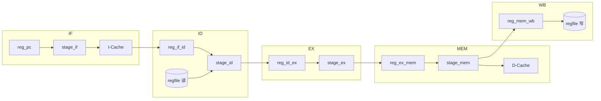

# RISC-V 五级流水线 CPU（Verilog）

作者：Zhou Fan（范舟）。本项目为上海交通大学 ACM 班《计算机体系结构》课程设计，使用 Verilog HDL 实现 **RISC-V RV32I 子集** 的 **五级流水线处理器**，支持 **数据前推（转发）**、**I-Cache / D-Cache**（N 路组相联），并通过 **UART** 与 PC 端内存模拟器通信，便于在 FPGA 等资源受限环境下运行程序。

英文说明与配图见根目录 [README.md](README.md)；指令列表见 [doc/inst-supported.md](doc/inst-supported.md)；详细报告见 [doc/project-report.pdf](doc/project-report.pdf)。

---

## 1. 功能概览

| 项目 | 说明 |
|------|------|
| ISA | RISC-V RV32I（见 [doc/inst-supported.md](doc/inst-supported.md)） |
| 流水线 | 5 级：IF → ID → EX → MEM → WB |
| 数据冒险 | ID 段操作数前推（来自 EX、MEM）；**load-use** 通过流水线停顿解决 |
| 控制冒险 | 分支/跳转在 ID 判定；配合 **PC 更新** 与 **IF/ID 清空** |
| Cache | 指令 Cache 与数据 Cache 分离，组相联结构（实现参考张哲恺 MIPS CPU 的 cache 设计） |
| 外设 | UART（默认约 40 MHz 时钟、2 304 000 波特率，见 `uart_trans.v` 参数） |

---

## 2. 文件结构

以下为仓库主要目录与文件（以项目根目录为起点；若你从压缩包解压得到外层 `RISC-V-CPU-master` 文件夹，则再进一层同名目录即为根）。

```
.
├── README.md                 # 英文说明与配图引用
├── README_zh-CN.md           # 本中文说明
├── .gitignore
├── doc/                      # 文档与报告源文件
│   ├── inst-supported.md     # 已实现的 RV32I 指令表
│   ├── project-report.tex    # 课程报告 LaTeX 源
│   └── riscv-toolchain-installation-usage.md  # 工具链安装与使用（中文）
├── src/
│   ├── cpu/                  # 处理器与 SoC 相关 Verilog/VHDL
│   │   ├── cpu.v             # FPGA 顶层：时钟、复位、UART、mem_ctrl、riscv_cpu
│   │   ├── riscv_cpu.v       # CPU 核 + I/D Cache 与后端双端口连接
│   │   ├── defines.v         # 指令字段、ALU 编码、总线宽度等宏定义
│   │   ├── ctrl.v            # 流水线 stall 控制
│   │   ├── reg_pc.v          # PC 寄存器
│   │   ├── reg_if_id.v       # IF/ID 流水寄存器
│   │   ├── reg_id_ex.v       # ID/EX 流水寄存器
│   │   ├── reg_ex_mem.v      # EX/MEM 流水寄存器
│   │   ├── reg_mem_wb.v      # MEM/WB 流水寄存器
│   │   ├── regfile.v         # 通用寄存器堆 x0–x31
│   │   ├── stage_if.v        # 取指级
│   │   ├── stage_id.v        # 译码级（含转发与 load-use 检测）
│   │   ├── stage_ex.v        # 执行级
│   │   ├── stage_mem.v       # 访存级
│   │   ├── cache.v           # I-Cache / D-Cache（组相联）
│   │   ├── simple_ram.v      # Cache 后端简单 RAM（cache 内引用）
│   │   ├── mem_ctrl.v        # 与 UART 帧协议对接的存储控制器
│   │   ├── uart_trans.v      # UART 收发与 FIFO
│   │   ├── utility.v         # 公用函数/宏（如 clog2）
│   │   ├── library/          # 可复用 IP 与封装
│   │   │   ├── fifo.v
│   │   │   ├── mfifo.v
│   │   │   ├── multichan_trans.v  # 多通道 UART 消息封装
│   │   │   └── clk_wiz_0_tmp.vhd  # 时钟向导生成物（Vivado）
│   │   └── no use/           # 历史/最小系统示例，非当前主流程
│   │       ├── inst_rom.v
│   │       ├── ram.v
│   │       └── riscv_min_sopc.v
│   └── memory/               # PC 端内存模拟器（C++，经串口配合 FPGA）
│       ├── main.cpp
│       ├── adapter.cpp / adapter.h
│       ├── environment.cpp / environment.h
│       ├── env_iface.h
│       ├── simulator.cpp / simulator.h
│       └── build.sh
└── test/                     # 仿真与测试程序
    ├── test_bench.v          # 仿真顶层示例
    ├── sim_cpu.v             # CPU + 存储相关仿真封装
    ├── sim_mem.v             # 通过 UART 模拟内存一侧
    ├── Makefile
    ├── memory.ld             # 链接脚本
    ├── inst.S / test.S       # 汇编测试
    ├── *.data                # 指令/数据十六进制初始化文件
    ├── bin2ascii.py / bin-tail.py  # 二进制与文本转换辅助脚本
    └── runtime.txt
```

**说明**：英文 README 中提到的 `doc/project-report.pdf`、`doc/cpu-pipeline-graph.png` 等若未随仓库一并提供，需在本地用 LaTeX 编译报告或从作者发布渠道获取配图。

---

## 3. 顶层模块 `cpu` 的端口说明

顶层文件：`src/cpu/cpu.v`。面向 **Basys3 等 FPGA 板卡** 的典型接口如下。

| 方向 | 信号 | 含义 |
|------|------|------|
| 输入 | `EXCLK` | 板载晶振时钟，经 `clk_wiz_0` 倍频/分频得到内核时钟（与 UART 模块 `CLOCKRATE` 一致配置为 40 MHz） |
| 输入 | `button` | 低有效复位相关逻辑：按下时拉高内部复位，松开后经一拍延迟释放（`rst_led` 可观察复位状态） |
| 输出 | `rst_led` | 与内部 `rst` 相连，指示复位 |
| 输出 | `Tx` | UART 发送，接 PC 串口/USB‑UART 的 RX |
| 输入 | `Rx` | UART 接收，接 PC 的 TX |

片上连接关系（概念上）：`uart_trans` ↔ `multichan_trans`（多通道帧封装）↔ `mem_ctrl`（读写请求打包）↔ **`riscv_cpu` 暴露的两路存储端口**（I-Cache、D-Cache 各占一路）。

---

## 4. 核心 `riscv_cpu` 的存储与 Cache 端口

文件：`src/cpu/riscv_cpu.v`。

- **`mem_rwe_o[3:0]`**：两路存储，每路 2 bit。高位字（`[3:2]`）对应 **I-Cache** 对后端存储的读写请求；低位字（`[1:0]`）对应 **D-Cache**。Cache 模块约定 `[0]` 为读、`[1]` 为写（与 `cache.v` 注释一致）。
- **`mem_addr_o[63:0]`**：`[63:32]` 为 I-Cache 访存地址，`[31:0]` 为 D-Cache 访存地址（32 位对齐的 RISC-V 地址空间）。
- **`mem_data_i` / `mem_data_o`**：各 64 bit，高、低 32 bit 分别对应两路的读回数据与写出数据。
- **`mem_sel_o[7:0]`**：字节写使能掩码，高 4 bit 对 I-Cache 后端写（本工程指令 Cache 不写，多为 0），低 4 bit 对 D-Cache 写字节选通。
- **`mem_busy_i` / `mem_done_i`**：各 2 bit，分别表示两路后端事务忙/完成，与 `mem_ctrl` 对接。

**设计意图**：指令与数据通路在 **后端存储接口上物理分离**，便于 I-Cache、D-Cache 独立填线、独立阻塞，与哈佛结构在实现层面对齐；对外仍通过 UART 合并为一根串行链路。

---

## 5. 五级流水线与数据通路（流程图）

逻辑阶段与 Verilog 模块对应关系：

1. **IF（取指）**：`reg_pc` → `stage_if` → **I-Cache**；输出当前 PC 对应的指令与 PC 值。
2. **ID（译码）**：`reg_if_id` → `stage_id` + **`regfile` 读口**；生成 ALU 操作、立即数、寄存器写地址、分支目标等。
3. **EX（执行）**：`reg_id_ex` → `stage_ex`；算术/逻辑/移位、分支条件已在 ID 结合，EX 主要完成 ALU 与访存地址计算等。
4. **MEM（访存）**：`reg_ex_mem` → `stage_mem` → **D-Cache**；load/store 在此与数据 Cache 交互。
5. **WB（写回）**：`reg_mem_wb`；结果写回 **`regfile`**（`x0` 恒不写）。



**控制流补充**（与 [README.md](README.md) 中 pipeline 图一致的思想）：

- **停顿（stall）**：`ctrl` 根据 `stallreq_if` / `id` / `ex` / `mem` 的优先级组合出 6 位 `stall[5:0]`，从 MEM 级向前逐级冻结，解决 **Cache 未命中等待**、**load-use** 等。
- **前推（转发）**：在 **`stage_id`** 里，若源寄存器与 EX 或 MEM 级待写寄存器相同，直接用 **`ex_reg_wdata` / `mem_reg_wdata`** 作为 `opv1`、`opv2`，避免多数 RAW 冒险再等多拍。
- **load-use**：若 EX 级为 load 且目的寄存器与当前指令源寄存器冲突，无法用转发消除，则置位 `stallreq`，由 `ctrl` 停顿流水线（见 `stage_id.v` 中 `SET_OPV` 宏）。
- **分支/跳转**：在 ID 生成 `br`、`br_addr`；`reg_pc` 在时钟沿更新 PC；`reg_if_id` 在 `br` 或特定 stall 条件下 **清空** 指令槽，避免错误指令进入 ID。

---

## 6. 各类“寄存器”的作用说明

### 6.1 流水线边界寄存器（Pipeline Registers）

| 模块 | 作用 |
|------|------|
| `reg_pc` | 保存程序计数器 PC；支持 `stall[0]` 暂停更新；分支时载入 `br_addr`，并配合 `right_one_o` 与 `stage_if` 处理“刚跳转后第一拍取指”的时序。 |
| `reg_if_id` | IF/ID：锁存取到的 `pc` 与 `inst`；**分支 `br` 或 flush 条件**下输出清为 0，避免分支延迟槽错误指令。 |
| `reg_id_ex` | ID/EX：将译码后的 `aluop`、`alusel`、两操作数、`reg_waddr`、`we`、`link_addr`、`mem_offset` 等送执行级。 |
| `reg_ex_mem` | EX/MEM：锁存 ALU 结果、写寄存器地址与写使能、访存地址、`aluop`（区分 load/store 类型）、`rt` 的旁路数据等。 |
| `reg_mem_wb` | MEM/WB：锁存最终写回寄存器堆的数据与地址，驱动 WB。 |

### 6.2 通用寄存器堆（Architectural Registers）

模块：`regfile.v`，**32 个 32 位** 寄存器 **`x0`–`x31`**。

- **读**：两读口 `raddr1`/`raddr2`，组合逻辑输出；`x0` 读恒为 0。
- **写**：单写口，**上升沿**写入；**`x0` 不写**（符合 RISC-V 约定）。
- **同周期读写相关**：若写地址与读地址相同且写使能有效，读口直接返回 **`wdata`**（旁路），避免 WB 与 ID 同一寄存器冲突。

### 6.3 控制寄存器 `stall[5:0]`（`ctrl.v`）

编码约定（注释见源码）：

- `stall[0]`：冻结 PC  
- `stall[1]`：冻结 IF  
- `stall[2]`：冻结 ID  
- `stall[3]`：冻结 EX  
- `stall[4]`：冻结 MEM  
- `stall[5]`：冻结 WB  

优先级：**MEM 请求停顿 > EX > ID > IF**，保证最靠近存储器的阻塞向前传播，数据一致。

---

## 7. 设计思路小结

1. **教科书式五级流水**：与《计算机体系结构：量化研究方法》等教材中的经典 RISC 流水线划分一致，便于对照学习 hazard、stall、forwarding。
2. **在 ID 段集中做操作数前推**：把 EX/MEM 的写回数据提前接到译码级操作数多路选择，减少 ALU 输入对旧寄存器值的依赖；无法覆盖的 **load-use** 仍用 **停顿** 保证正确性。
3. **哈佛风格的后端接口**：I-Cache、D-Cache 各占独立 `mem_*` 通道，与 `mem_ctrl` 的多端口调度契合；Cache 采用 **组相联 + LRU 类替换**（见 `cache.v`），在面积与命中率之间折中。
4. **FPGA 实用路径**：大容量存储不放在片上，而通过 **UART 帧协议** 由 PC 上程序模拟内存（`src/memory/` 与测试平台中的思路）；便于用 Vivado 仿真或与真实串口联调。

---

## 8. 核心文件速查

| 路径 | 内容 |
|------|------|
| `src/cpu/riscv_cpu.v` | 核心 CPU + 双 Cache 连接 |
| `src/cpu/cpu.v` | FPGA 顶层 + UART + mem_ctrl |
| `src/cpu/stage_*.v` | 各级流水逻辑 |
| `src/cpu/ctrl.v` | 停顿控制 |
| `src/cpu/cache.v` | Cache |
| `src/cpu/mem_ctrl.v` | 与 UART 之间的存储事务打包 |
| `test/` | 仿真顶层、`sim_cpu` / `sim_mem`、汇编与转换脚本 |

完整树状结构见 **§2 文件结构**。工具链与交叉编译环境可参考 [doc/riscv-toolchain-installation-usage.md](doc/riscv-toolchain-installation-usage.md)。

---

## 9. 参考文献（与英文 README 一致）

- 雷思磊．《自己动手写 CPU》．电子工业出版社，2014．  
- John L. Hennessy, David A. Patterson 等．*Computer Architecture: A Quantitative Approach*, 5th ed., 2012．  
- David A. Patterson．CS252 Graduate Computer Architecture 课件，2001．  
- [Zhekai Zhang 的 MIPS CPU 项目](https://github.com/sxtyzhangzk/mips-cpu)（Cache 等代码基础）  
- Chris Fletcher．*Verilog: always @ Blocks*（见 `doc/Always@.pdf`）

---

*说明：原英文 README 中关于 Meltdown/Spectre 的表述为课程趣味说明；本 CPU 无分支预测与乱序执行，因而不具备现代乱序核上的同类微架构侧信道场景。*
